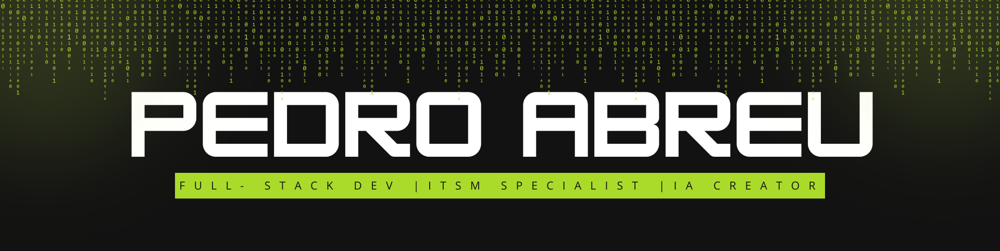

  

---

  🔧 Especialista em BMC Helix ITSM & automações 
  👨‍💻 Desenvolvedor full-stack com foco em soluções criativas 
  🤖 Criador de IA personalizada local (projeto: <b>SOL</b>) 

---

## 🚀 Sobre mim

Sou movido por tecnologia, inovação e café forte. Atualmente, atuo como Analista de Sistemas com foco em ITSM (BMC Helix), mas também mergulho em desenvolvimento web e projetos ousados de IA local com memória, contexto e muita personalidade.

---

## 🧰 Tecnologias e Ferramentas

  
  
  
  
  
  

---

## 📊 Stats de Performance

  
  

---

## 🔥 GitHub Streak

  

---

## 📬 Contato

  
  

---

  

  🟩 "Transformando ideias em realidade — uma linha de código por vez."

